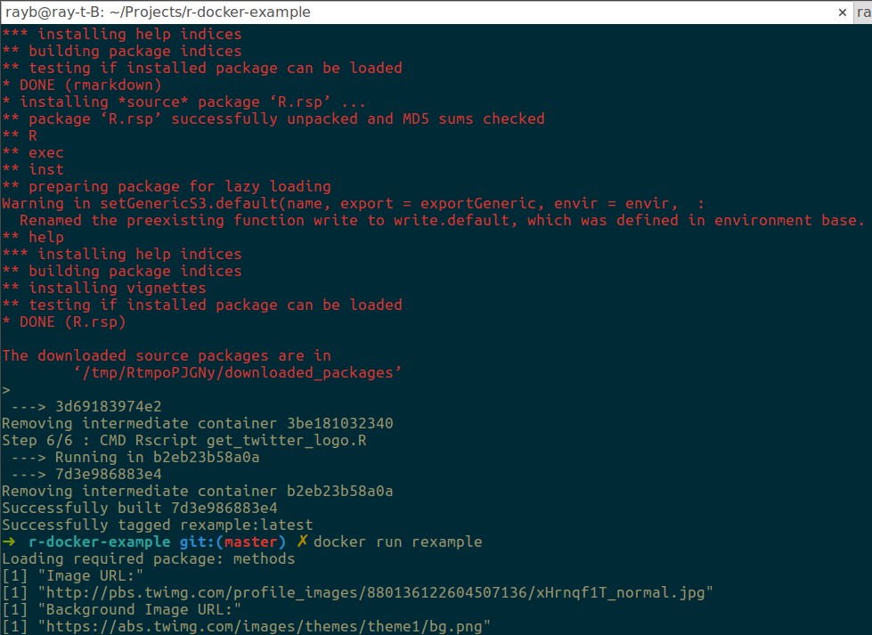

# r-docker-example

small exampe for using Docker to execute a R script

## Why?

I wanted to have a public place to emulate building a Rscript into a Docker container to serve as an easily accessible example.

Docker makes it easy to deploy R code to _"production"_ environments. Essentially, everything the R code depends on is declared in the Dockerfile.
This way the system running the Docker container doesn't need to install any dependencies (libraries) that conflict with other programs running on the system. 
Everything is _containerized_. This also means there is no excuse for not using R to handle production work if you already have working code.

## How?

The repo has two R scripts, *get_twitter_logo.R* and *install_libraries.R*.

- `install_libraries.R` literally just installs the libraries being used in the R script that does the work
- `get_twitter_logo.R` is a trivial and arbitrary example using the Twitter REST API to retrieve the profile_image_url and profile_background_image_url of a given user

    - _Note:_ I use environment variables to store the Twitter API credentials. To do this, I used a `.Renviron` file stored in this project directory (repo, folder). I added `.Renviron` to the `.gitignore` file in this repo so that hooligans won't abuse my API account. You should probably also do that.

Once you have created your R script to install the necessary R libraries and your script to perform some meaningful work (i.e. not just print to stdout), you may need to update the Dockerfile. For example, the R libraries I used, `httr` and `jsonlite`, depend on several lower level libraries written in C and C++, such as `libssl-dev`. Be sure to include _everything_ your scripts need in the Dockerfile so that your code can actually run.

With a complete Dockerfile and R scripts to execute your code, you need to build a Docker image based on your Dockerfile. (Note: you must have docker installed to do this.) Run the command:

```shell
docker build -t [insert clever name for your image here] /path/to/repo/
```

_Note:_ if you are already have the repo set to your current working directory, then you can substitute `.` to mean "in this directory". 

Building the Docker image could take a while depending on what base image you use and what libraries you need to install. Ideally we would use a small image as the base, but here I used `r-base:latest` as my starting point, which just happens to be built on top of the `debian:testing` image. In other words, not the smallest starting point, but it has R installed by default.

Once the build command finishes, you can run your script with the command:

```shell
docker run [use the clever name from before here]
```

and whatever you told the Dockerfile in the last section, e.g. `CMD ["Rscript", "my_cool_r_script.R"]` will execute in the docker container just built. 

Here is my screenshot:


